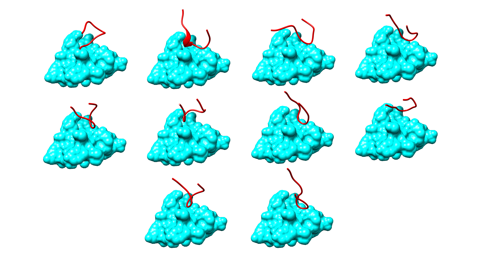

# LoopGen: De novo design of peptide CDR binding loops with SE(3) diffusion models.

LoopGen is a python package providing functionality for diffusion models for CDR binding loop design. 
Our model performs diffusion over the space of residue orientations and positions, generating 
diverse loop conformations that fit the geometry of the target epitope.



## Setting up

---

Follow the steps below to set up the virtual environment for this project.

If you have not installed miniconda on your computer, follow the instructions here to 
[install miniconda](https://conda.io/projects/conda/en/latest/user-guide/install/index.html).

Once you have miniconda, you need to install `mamba` in the base environment:

```
conda install mamba -n base -c conda-forge
```

Then all you need to do is clone the repository and move into it:

```bash
git clone https://gitlab.developers.cam.ac.uk/ch/sormanni/loopgen.git
cd loopgen
```

And then run the setup script:
```bash
bash setup_env.sh
```

And finally activate the conda environment:

```bash
conda activate loopgen
```

And you are ready to go! 


## Data

This package relies on CDR/epitope structural information. We have found that 
these data types are best stored using `hdf5` format. The basic structure we choose 
to use is as follows:

```
- <PDB id>
    - <receptor/ligand pair id>
        - "receptor"
            - "N_coords" (N, 3) array of nitrogen coordinates for N receptor residues
            - "CA_coords" (N, 3) array of CA coordinates for N receptor residues
            - "C_coords" (N, 3) array of C coordinates for N receptor residues
            - "CB_coords" (N, 3) array of CB coordinates for N receptor residues (can be anything for glycines)
            - "sequence" (N,) array of integers 0-19, based on sorted 3-letter AA codes
        - "ligand"
            - "N_coords" (M, 3) array of nitrogen coordinates for M ligand residues
            - "CA_coords" (M, 3) array of CA coordinates for M ligand residues
            - "C_coords" (M, 3) array of C coordinates for M ligand residues
            - "CB_coords" (M, 3) array of CB coordinates for M ligand residues (can be anything for glycines)
            - "sequence" (M,) array of integers 0-19, based on sorted 3-letter AA codes
```

However our pipeline can handle any format so long as the key format
from `receptor`/`ligand` and below is consistent. In our case, `receptor` refers to the 
epitope and `ligand` refers to the CDR loop.

If you have an `hdf5` file with this structure, you can read it in as follows:

```
from loopgen import ReceptorLigandDataset

dataset = ReceptorLigandDataset.from_hdf5_file(<path/to/hdf5/file>)
```


## Usage

The basic structure of the command-line interface is as follows:

```
loopgen <model> <command> /path/to/hdf5/file [options]
```

To generate structures for an epitope, you can use the `generate` command:

```
loopgen frames generate /path/to/pdb/file --checkpoint /path/to/weights.ckpt --
```

Where `<model>` can be either `frames` (diffusion over SE3) or `coords` (diffusion over R3). 
For `command`, users can select either `train` (train a model) or `generate` (generate from a model),
both of which use an HDF5 dataset (formatted as above) as input. For example, to train a frame
diffusion model, run:

```
loopgen frames train /path/to/hdf5/file --splits /path/to/json/file --config /path/to/yaml/file 
```

You can see all the relevant options for each command by running `loopgen <model> <command> --help`.
