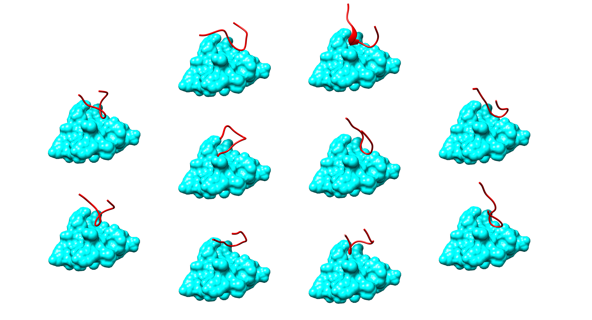

# LoopGen: De novo design of antibody CDR loops with SE(3) diffusion models

LoopGen is a python package providing functionality for diffusion models for CDR binding loop design. 
Read more in our [paper](https://arxiv.org/abs/2310.07051).

Our model performs diffusion over the space of residue orientations and positions, generating 
diverse loop conformations that fit the geometry of the target epitope. Currently, the model does
not generate sequences for the CDR loops - only backbone conformations. We hope to extend our model 
to generate sequences in the future.



## Setting up

---

Follow the steps below to set up the virtual environment for this project.

If you have not installed miniconda on your computer, follow the instructions here to 
[install miniconda](https://conda.io/projects/conda/en/latest/user-guide/install/index.html).

Once you have miniconda, you need to install `mamba` in the base environment:

```
conda install mamba -n base -c conda-forge
```

Then all you need to do is clone the repository and move into it:

```bash
git clone https://gitlab.developers.cam.ac.uk/ch/sormanni/loopgen.git
cd loopgen
```

And then run the setup script:
```bash
bash setup_env.sh
```

And finally activate the conda environment:

```bash
conda activate loopgen
```

And you are ready to go!

## Usage

The basic structure of the command-line interface is as follows:

```
loopgen <model> <command> /path/to/data/file [options]
```

Where `<model>` can be either `frames` (diffusion over SE3) or `coords` (diffusion over R3). 
For `<command>`, users can select either `train` (train a model) or `generate` (generate from a model).

To generate binding loop structures for an input epitope, you can use the `generate` command:

```
loopgen frames generate /path/to/pdb/file --checkpoint /path/to/weights.ckpt --config config/best.yaml
```

To ensure reasonable performance, we recommend using a reduced PDB file containing only a subset of residues 
to be targeted by the generated CDR loops. Note that the CDR will be generated with centre of mass at the 
origin (0, 0, 0) of the coordinate system in the PDB file, so the epitope should be transformed so that it 
is an appropriate distance and orientation to the CDR. We recommend placing the epitope centre of mass 10-12 
angstroms from the origin. Users can also input an HDF5 file (see below) for generation.

Users can also pass the flags `--permute_epitopes`, `--scramble_epitopes`, `---translate_cdrs`
to run generation under different perturbations of the input epitope. We use these perturbations to evaluate
the dependence of generated structures on different features of the target protein. See 
[the paper](https://arxiv.org/abs/2310.07051) for more details.

## Training

To train a frame diffusion model, run:

```
loopgen frames train /path/to/hdf5/file --splits /path/to/json/file --config /path/to/yaml/file 
```
 
You can see all the relevant options for each command by running `loopgen <model> <command> --help`.

You can access our datasets (including generated structures), training splits, 
and trained weights [here](https://drive.google.com/drive/folders/1cxJV5MnMBTl8VjqkfIo4EsRCSDLHWh1B?usp=drive_link).

We use `mlflow` for our logging and experiment tracking, which is installed as part of the virtual environment. To use
`mlflow` interactively, run the following from the virtual environment on the machine where you're training:

`mflow ui --host 0.0.0.0 --port <port-number>`

Which deploys an mlflow server on port `<port-number>`. Then use the browser on your local machine to access:

`<machine-ip>:<port-number>`

### Dataset format

Training relies on CDR/epitope structural information. We have found that 
these data types are best stored using `hdf5` format. The basic structure we choose 
to use is as follows:

```
- <PDB id>
    - <receptor/ligand pair id>
        - "receptor"
            - "N_coords" (N, 3) array of nitrogen coordinates for N receptor residues
            - "CA_coords" (N, 3) array of CA coordinates for N receptor residues
            - "C_coords" (N, 3) array of C coordinates for N receptor residues
            - "CB_coords" (N, 3) array of CB coordinates for N receptor residues (can be anything for glycines)
            - "sequence" (N,) array of integers 0-19, based on sorted 3-letter AA codes
        - "ligand"
            - "N_coords" (M, 3) array of nitrogen coordinates for M ligand residues
            - "CA_coords" (M, 3) array of CA coordinates for M ligand residues
            - "C_coords" (M, 3) array of C coordinates for M ligand residues
            - "CB_coords" (M, 3) array of CB coordinates for M ligand residues (can be anything for glycines)
            - "sequence" (M,) array of integers 0-19, based on sorted 3-letter AA codes
```

However our pipeline can handle any format so long as the key/value structure
from `receptor`/`ligand` and below is consistent. In our case, `receptor` refers to the 
epitope and `ligand` refers to the CDR loop.

### Config

The config file is a YAML file containing all the hyperparameters for training. 
The possible options (for both `frames` and `coords` models) are as follows:

- `learning_rate`: Learning rate used for training (default: `1e-4`) 
- `batch_size`: Batch size used for training. The default of 128 requires about 30Gb of GPU memory. (default: `128`)
- `self_conditioning_rate`: Rate at which self-conditioning will be trained. Implementation
is the same as RFDiffusion (default: `0.5`)
- `num_time_steps`: Number of time steps to use for the diffusion discretisation (default: `100`).
- `min_trans_beta`: Minimum value of the coefficients used to calculate variances for the noised translations (default: `1e-4`)
- `max_trans_beta`: Maximum value of the coefficients used to calculate variances for the noised translations (default: `20.0`)
- `translation_beta_schedule`: Schedule to use for the coefficients used to calculate variances for the noised translations. (default: `linear`)
- `time_step_encoding_channels`: Number of features to use for the sinusoidal time step encoding. (default: `5`)
- `use_cdr_positional_encoding`: Whether to use a positional encoding for ligand (CDR) residues. This should
only be used if ligands are linear polypeptide fragments, and it assumes the coordinate arrays in the dataset
file are N-to-C ordered in the input HDF5 file. (default: `True`)
- `positional_encoding_channels`: Number of features to use for the positional encoding. (default: `5`)
- `hidden_scalar_channels`: Dimensionality of the hidden layer node scalar features in the GVP-GNN. (default: `128`)
- `hidden_vector_channels`: Dimensionality of the hidden layer node vector features in the GVP-GNN. (default: `64`)
- `hidden_edge_scalar_channels`: Dimensionality of the hidden layer edge scalar features in the GVP-GNN. (default: `64`)
- `hidden_edge_vector_channels`: Dimensionality of the hidden layer edge vector features in the GVP-GNN. (default: `32`)
- `num_layers`: Number of message passing layers in the GVP-GNN. (default: `3`)
- `dropout`: Dropout rate to use in the GVP-GNN. (default: `0.2`)
- `aggr`: Message aggregation method to use in the GVP-GNN. (default: `sum`)

For the `frames` models, there are a few additional parameters:
- `rotation_beta_schedule`: Schedule to use for the coefficients used to calculate variances for the noised rotations. (default: `logarithmic`)
- `min_rot_beta`: Minimum value of the coefficients used to calculate variances for the noised rotations (default: `0.1`)
- `max_rot_beta`: Maximum value of the coefficients used to calculate variances for the noised rotations (default: `1.5`)
- `igso3_support_n`: Number of terms used to discretise angles of rotation when sampling from IGSO3. (default: `2000`)
- `igso3_expansion_n`: Number of terms used to approximate the infinite sum in the IGSO3 density function (default: `2000`)

All of these parameters can be passed in an input config YAML file to the `train` command. When using `generate`
with a trained model, the same config file should be passed as an argument.
